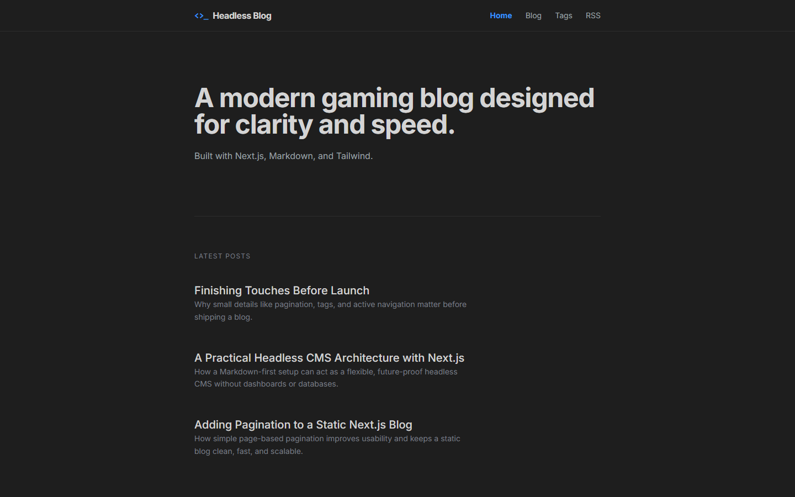

[](LICENSE)
[](https://nextjs.org)
[](https://tailwindcss.com)


# Headless Blog Frontend

A minimal, dark, developer-first blog template built with **Next.js**, **Markdown**, and **Tailwind CSS**.  
Designed to feel like a developer tool — fast, clean, and headless by default.




**Live Demo:** https://headless-blog-psi.vercel.app

## Features

- ⚡ App Router + Static Generation
- 📝 Markdown-based content
- 🧠 Headless CMS–style architecture
- 🌙 Dark / Light / System theme support
- 🏷️ Tags, pagination, RSS & sitemap
- 🔍 SEO-friendly by default


## Tech Stack

- **Framework:** Next.js (App Router)
- **Styling:** Tailwind CSS v4
- **Content:** Markdown + gray-matter
- **Typography:** Tailwind Typography
- **Themes:** next-themes
- **Deployment:** Vercel


## Getting Started

```bash
npm install
npm run dev

## License

MIT — free to use, modify, and distribute.